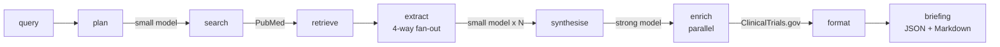

# Folio

A domain-specialised, open-source research agent for drug discovery, built on
[Featherless](https://featherless.ai). Give it a target protein or disease
area; it searches PubMed, extracts compound candidates and mechanisms from the
papers, cross-references ClinicalTrials.gov, and produces a structured
research briefing with inline citations.

The engine is async-first: `run_pipeline(query)` is a single async generator
that yields progress events as the agent works. A small FastAPI app wraps it
and streams those events to a scientist-facing web UI as Server-Sent Events;
the CLI prints the same stream to the terminal. Optional Supabase persistence
gives history + permalinks per briefing.

MIT-licensed. Reproducible from a clone in under a minute.

## Two ways to run it

**Web UI** (the way a scientist will actually use it):

```bash
python app.py
# -> http://127.0.0.1:8000
```

The UI follows the persistent-sidebar pattern from Claude / ChatGPT:

- A floating hero search island at first paint
- A left rail with **recent briefings** always visible (Supabase-backed),
  in-sidebar search, and a "+ New brief" reset button
- A two-pane workspace once a query runs: papers on the left (sortable,
  filterable by study type, searchable by PMID / compound / keyword), the
  rendered briefing on the right
- A **stage-aware loading state** that names what's happening per pipeline
  phase (e.g. *"Extracting compounds and mechanisms · 12 of 25 papers · ~18s left"*)
- Click any paper row → modal with the full abstract plus every field the
  AI extracted: compounds, mechanism, key finding, variant / mutation,
  potency, selectivity, study type, resistance mechanism, relevance
- **Notes scratchpad** below each briefing — autosaves to Supabase 800ms
  after the last keystroke, restored on reload, per-briefing
- **Download dropdown** → Markdown (.md) or a server-side rendered PDF
  with proper page margins (WeasyPrint; bypasses Chrome's print dialog
  so the output is identical across browsers and OSes)

**CLI** (for dev, CI, scripting, or a fallback demo):

```bash
python run.py "EGFR inhibitors for non-small-cell lung cancer"
```

## Pipeline

```
plan → search → retrieve → extract → synthesise → enrich → format
```

| Node | What it does | External call |
|------|--------------|---------------|
| plan | expand the query into deduplicated PubMed search terms | Featherless: small model |
| search | PubMed ESearch returns PMIDs ranked by relevance | NCBI E-utilities |
| retrieve | PubMed EFetch returns titles, abstracts and metadata | NCBI E-utilities |
| extract | per-paper: compounds, mechanism, key finding, variant, potency, selectivity, study type, resistance, relevance | Featherless: small model, fanned out |
| synthesise | cluster, rank, surface contradictions, write the briefing | Featherless: strong model, one call |
| enrich | per top-compound: phase + trial activity from ClinicalTrials.gov | ClinicalTrials.gov v2 API |
| format | render the structured briefing as JSON + Markdown | none |



## Concurrency model

Featherless Premium reserves 4 concurrent connection slots. Model size
consumes the slot budget: 7B-15B models cost 1 slot, 24B-34B cost 2, 70B+ and
DeepSeek / Kimi cost 4. The pipeline is shaped around that.

- **Extraction fan-out** uses a small model (default
  `mistralai/Mistral-Nemo-Instruct-2407`, 12B, 32K context, 1 slot). One
  semaphore in `engine/featherless.py` caps in-flight calls at 4. For 25
  papers, ~6 waves of 4 finish the extraction phase in roughly 60-70s.
- **Synthesis** uses a strong model (default `deepseek-ai/DeepSeek-V3.2`,
  4 slots). Runs alone after the fan-out drains; the strong model's slot
  cost doesn't block extraction.
- **ClinicalTrials.gov enrichment** runs the top compounds in parallel
  through a separate per-host semaphore (default 5). No Featherless slots
  used here; this is a public API call.

End-to-end wall time is ~75-100 seconds for a typical 25-paper query when
the models are warm; first call of the day can stretch to several minutes
on a Featherless cold-start (handled by the retry/backoff in
`engine/featherless.py`).

A process-wide singleton `FeatherlessClient` is exposed via
`engine.pipeline.get_default_clients()`. The web layer uses it so two
concurrent in-flight pipelines actually share the 4-slot budget instead of
each opening their own 4.

## Resilience

- **Cold-start retries.** Featherless calls retry with exponential backoff
  (2 → 4 → 8 → 16 → 32s) up to 5 attempts. `APIStatusError`,
  `APIConnectionError`, `APITimeoutError`, and `httpx.TimeoutException` all
  go through retry. Total backoff budget covers the 30-60s cold-start
  window the platform documents.
- **Per-paper extraction failures** are isolated: one malformed model
  response is logged and that paper is marked `skipped`; the other 24
  continue.
- **Synthesis fallback.** If the strong model returns an empty string or
  unparseable JSON (we have observed this with `zai-org/GLM-5.1` against a
  strict-JSON prompt), the briefing is rebuilt directly from the
  extractions — most-mentioned compounds, most-frequent mechanisms — so
  the demo never hard-fails on stage.
- **Cancellation-safe fan-out.** Both `node_extract` and `node_enrich_trials`
  cancel and drain in-flight tasks in a `finally` block, so a browser
  disconnect mid-stream does not leak tasks.

## Evaluation

Folio ships with a runnable benchmark in `evals_quality.py` that measures
the two dimensions most relevant to whether you can trust a synthesised
drug-discovery briefing:

```bash
python evals_quality.py
```

### Extraction precision + citation grounding — does the agent fabricate?

The benchmark runs five canonical drug-discovery queries with 15 papers
each and measures two trust-relevant dimensions:

- **Extraction precision**: of all compounds the extractor names from a
  paper, what fraction actually appear in that paper's title or abstract?
  Catches the model inventing molecules from outside the source.
- **Citation grounding**: every `[PMID:NNN]` tag in the synthesised summary
  must point to a PMID we actually retrieved in this run. Catches
  fabricated citations.

| Query | Extraction precision | Citation grounding | Time |
|---|---|---|---|
| EGFR inhibitors for non-small-cell lung cancer | 19/19 (100%) | 11/11 (100%) | 77.6s |
| BRAF V600E melanoma | 13/13 (100%) | 6/6 (100%) | 72.9s |
| KRAS G12C inhibitors for solid tumors | 22/22 (100%) | 7/7 (100%) | 66.7s |
| HER2 positive breast cancer | 31/31 (100%) | 6/6 (100%) | 70.9s |
| PD-L1 checkpoint inhibitors for cancer | 24/25 (96%) | 9/9 (100%) | 73.6s |
| **Overall** | **109/110 (99%)** | **39/39 (100%)** | |

The single precision miss across 110 extractions is `prologolimab` on
PMID 35062949 — a real PD-1 antibody (Biocad, approved in Russia) whose
generic name does not appear in the abstract; the paper most likely uses
the development code `BCD-100` instead. The model named the drug correctly
but failed the strict "appears verbatim in source" test. Not a fabrication.

Citation grounding hit 100% across all 39 inline PMIDs the synthesis model
emitted — every cited paper was one Folio had actually retrieved and
extracted from. No fabricated citations across the five queries.

**How we got from 90% to 99%.** The earlier run surfaced two miss patterns:
class-to-instance expansion (a paper says *"PD-(L)1 blockade"* and the
extractor invents *Pembrolizumab, Nivolumab, Atezolizumab*) and drug-class
leakage (*"PD-1 inhibitor"* returned as if it were a compound). Two
mitigations applied:

1. The extract prompt now explicitly forbids inferring specific drugs from
   class mentions and lists common class strings to never return.
2. `engine/pipeline.py` runs a defensive regex filter in `_build_extraction`
   that drops compounds matching class patterns (`anti-X`, `X inhibitor`,
   `X-TKI`, `X blockade`, `checkpoint`, etc.). Belt-and-braces with the
   prompt.

## Setup

You need Python 3.10+ and a Featherless Premium account (free for the
hackathon with code `LABLABMILAN`).

```bash
python -m venv .venv
source .venv/bin/activate
pip install -r requirements.txt
cp .env.example .env
```

Then fill in `.env`:

| Variable | Required? | What it does |
|---|---|---|
| `FEATHERLESS_API_KEY` | yes | Generate at featherless.ai → account → API keys |
| `NCBI_API_KEY` | no | Free, raises PubMed limit from 3 → 10 req/s |
| `NCBI_EMAIL` | no | Sent in PubMed calls per their etiquette |
| `EXTRACT_MODEL` | no | Default `mistralai/Mistral-Nemo-Instruct-2407` |
| `SYNTHESIS_MODEL` | no | Default `deepseek-ai/DeepSeek-V3.2` |
| `MAX_PAPERS` | no | Default 25 |
| `SUPABASE_URL` | no | Enables briefing history + permalinks |
| `SUPABASE_SECRET_KEY` | no | Server-side service-role key (`sb_secret_…`) |

If `SUPABASE_*` are unset the web UI still works — there's just no history
sidebar and refreshing loses the current briefing. The engine and the CLI
work without Supabase regardless.

## Optional: briefing history (Supabase)

Two tables in any Supabase project; create them once via SQL Editor:

```sql
create table if not exists biolit_briefings (
    id uuid primary key default gen_random_uuid(),
    query text not null,
    summary text,
    briefing jsonb not null,
    briefing_markdown text,
    paper_count int not null default 0,
    extraction_count int not null default 0,
    elapsed_seconds real,
    status text not null default 'ok',
    created_at timestamptz not null default now()
);
create index if not exists biolit_briefings_created_at_idx
    on biolit_briefings (created_at desc);

create table if not exists biolit_briefing_papers (
    id uuid primary key default gen_random_uuid(),
    briefing_id uuid not null references biolit_briefings(id) on delete cascade,
    pmid text not null, title text, journal text, year text, abstract text,
    extraction jsonb, relevance_score real,
    created_at timestamptz not null default now()
);
create index if not exists biolit_papers_briefing_id_idx
    on biolit_briefing_papers (briefing_id);
```

Set `SUPABASE_URL` and `SUPABASE_SECRET_KEY` (the server-side service-role
key, **not** the publishable / anon key) in `.env` and restart. Every
completed briefing persists; the web UI gets a "Recent" drawer in the
top bar and each briefing is permalinkable at
`/?briefing=<uuid>`.

## Programmatic use

```python
from engine.pipeline import run_pipeline

async for event in run_pipeline("BRAF V600E melanoma"):
    print(event.stage, event.message)
    if event.stage == "done":
        briefing = event.detail["briefing"]
        markdown = event.detail["briefing_markdown"]
```

For concurrent callers, share one client set so the Featherless 4-slot
budget is respected globally:

```python
from engine.pipeline import get_default_clients, run_pipeline

fl, pm, ct = get_default_clients()
async for event in run_pipeline("EGFR NSCLC", fl=fl, pm=pm, ct=ct):
    ...
```

## Models

Both model IDs are configured via `.env`; any Featherless catalogue model
fits the matching slot cost. No code change required to swap.

| Role | Default | Slot cost | Verified alternatives |
|---|---|---|---|
| Extraction (small, fan-out) | `mistralai/Mistral-Nemo-Instruct-2407` | 1 | `Qwen/Qwen2.5-7B-Instruct` (ran 25/25 papers cleanly) |
| Synthesis (strong, one call) | `deepseek-ai/DeepSeek-V3.2` | 4 | `moonshotai/Kimi-K2-Instruct` (full BRAF V600E briefing produced) |

`zai-org/GLM-5.1` returns an empty string against our strict-JSON synthesis
prompt; the synthesis-fallback handler catches this so the briefing still
ships, but it would need a prompt variant to be a first-class option.

## Module layout

```
biolitagent/
├── engine/
│   ├── __init__.py
│   ├── schema.py              data models + pipeline state (pydantic)
│   ├── prompts.py             plan / extract / synthesise prompts
│   ├── featherless.py         OpenAI-compatible client, retry/backoff, slot semaphore
│   ├── pubmed.py              PubMed E-utilities wrapper (ESearch + EFetch)
│   ├── clinicaltrials.py      ClinicalTrials.gov v2 API wrapper
│   ├── pipeline.py            seven nodes + run_pipeline() + alias collapse + fallback
│   ├── storage.py             Supabase REST persistence (optional)
│   └── render.py              briefing → Markdown (PMID + NCT links)
├── app.py                     FastAPI app: SSE + history + notes + PDF endpoints
├── templates/
│   ├── index.html             scientist UI shell (sidebar + workspace)
│   └── briefing_print.html    Jinja template WeasyPrint renders into a PDF
├── static/
│   ├── style.css              UI styles (hero, sidebar, workspace, print)
│   ├── app.js                 SSE consumer + DOM updates
│   ├── logo.png               brand mark used in topbar + favicon
│   └── logo-tagline.png       hero version used in the PDF cover
├── scripts/
│   └── backfill_authors.py    one-off: re-fetch authors for legacy paper rows
├── run.py                     headless CLI entrypoint
├── evals.py                   recall benchmark runner
├── evals_quality.py           precision + citation-grounding benchmark
├── requirements.txt
├── .env.example
└── LICENSE                    MIT
```

## Dependencies

| Layer | Packages |
|---|---|
| Engine + CLI | `openai`, `pydantic`, `httpx`, `python-dotenv` |
| Web UI | `fastapi`, `uvicorn[standard]`, `jinja2` |
| Server-side PDF | `weasyprint` (plus the Pango/Cairo system libraries — `brew install pango cairo libffi` on macOS, or the matching apt packages on Debian/Ubuntu) |

The engine and CLI run without the web-UI / PDF packages — uninstall them
if you only want the library. The PDF endpoint also degrades gracefully:
if WeasyPrint can't load its system libraries at import time, the server
disables `/api/briefing/{id}/pdf` with a 503 and the UI falls back to the
browser's "Save as PDF" path.

## Integration seam

```python
run_pipeline(query: str) -> AsyncIterator[ProgressEvent]
```

`ProgressEvent.stage` is a typed `Stage` enum
(`plan`, `search`, `retrieve`, `extract`, `synthesise`, `enrich`, `done`,
`error`). `ProgressEvent.detail` carries structured payloads:

- `plan` → `{"search_terms": [...]}`
- `retrieve` → `{"paper_count": N, "papers": [{pmid, title, abstract, ...}]}`
- `extract` (per paper) → `{"pmid", "completed", "total", "ok", "extraction": {...}}`
- `enrich` (per compound) → `{"compound", "trial_info": {...}}`
- `done` → `{"briefing": {...}, "briefing_markdown": "..."}`

The voice and web layers consume this stream. Schema additions are additive;
no field has ever been renamed or removed.

## License

MIT. See `LICENSE`.
