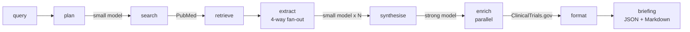

<p align="center">
  
</p>

<h1 align="center">Folio</h1>

<p align="center">
  <em>Biomedical literature, synthesised.</em><br/>
  A solo open-source agent that replaces a day of manual literature triage
  with a 90-second, fully-cited research briefing.
</p>

<p align="center">
  <a href="https://folio-g8kr.onrender.com"><strong>Live demo →</strong></a> ·
  <a href="https://github.com/olli1324/folio-bio">GitHub</a> ·
  <a href="LICENSE">MIT</a>
</p>

---

## Try it

```
https://folio-g8kr.onrender.com
```

No signup. Type a target, click **Brief me**, get a briefing in ~90 seconds.
First call of the day can take longer — Featherless cold-start.

## What it does

You give Folio a target protein, disease, or mechanism. It searches PubMed,
extracts compounds and mechanisms of action from each paper in parallel,
cross-references ClinicalTrials.gov for trial activity, and writes a
structured briefing with **every claim PMID-cited** and **every PMID
clickable**. The sidebar keeps every past briefing — it's a system of
record, not a one-shot chat.

Built solo over the five days of the AI Agent Olympics on the Featherless
track. MIT-licensed end to end.

## Why it exists

A new biomedical paper hits PubMed every **25 seconds** — 1.4 million a
year, the curve climbing. Drug discovery teams still triage that flow by
hand: a senior researcher asks a question, a junior scientist disappears
for the day with a stack of PDFs. A single literature review costs roughly
**$1,200** of loaded researcher time, and teams run three to five a week.

The work is repeatable and structured. It is exactly the kind of work an
agent should solve.

## How it works

```
plan → search → retrieve → extract → synthesise → enrich → format
```



The shape is dictated by the **Featherless 4-slot Premium budget**. A
small model (`mistralai/Mistral-Nemo-Instruct-2407`, 1 slot) fans out
across abstracts — four in flight at a time, ~6 waves for 25 papers.
A strong model (`deepseek-ai/DeepSeek-V3.2`, 4 slots) runs alone after
the fan-out drains. Wall time: **~75–100 seconds** warm. Every step
streams progress over SSE.

Full concurrency, resilience, and integration details live in
[`docs/architecture.md`](docs/architecture.md).

## Proof it works

Folio ships with a runnable benchmark (`evals_quality.py`) that measures
the two things that matter for a synthesised drug-discovery briefing —
does the agent **fabricate compounds**, and does it **fabricate citations**.

| Query | Extraction precision | Citation grounding | Time |
|---|---|---|---|
| EGFR inhibitors for NSCLC | 19/19 (100%) | 11/11 (100%) | 77.6s |
| BRAF V600E melanoma | 13/13 (100%) | 6/6 (100%) | 72.9s |
| KRAS G12C inhibitors | 22/22 (100%) | 7/7 (100%) | 66.7s |
| HER2 positive breast cancer | 31/31 (100%) | 6/6 (100%) | 70.9s |
| PD-L1 checkpoint inhibitors | 24/25 (96%) | 9/9 (100%) | 73.6s |
| **Overall** | **109/110 (99%)** | **39/39 (100%)** | |

The one extraction miss (`prologolimab`, PMID 35062949) is a real PD-1
antibody whose generic name doesn't appear in the abstract — the model
named it correctly but failed a strict "appears verbatim in source" test.
**Not a fabrication.**

Run it yourself:

```bash
python evals_quality.py
```

## Run it locally

You need Python 3.10+ and a Featherless Premium account
(free during the hackathon with code `LABLABMILAN`).

```bash
python -m venv .venv
source .venv/bin/activate
pip install -r requirements.txt
cp .env.example .env       # fill in FEATHERLESS_API_KEY

python app.py              # web UI at http://127.0.0.1:8000
# or
python run.py "EGFR inhibitors for non-small-cell lung cancer"   # CLI
```

The only required env var is `FEATHERLESS_API_KEY`. Optional vars
(`NCBI_API_KEY`, model overrides, `MAX_PAPERS`, `SUPABASE_*`) live in
`.env.example`. The web UI runs without Supabase — you just lose history
and permalinks. See [`docs/supabase.md`](docs/supabase.md) to enable it.

## What's next

- ClinicalTrials and ChEMBL as first-class extraction sources
- Three biotech design partners feeding real queries
- Briefing collections for programmes and portfolios

## Further reading

- [`docs/architecture.md`](docs/architecture.md) — concurrency, resilience,
  programmatic use, integration seam, module layout
- [`docs/supabase.md`](docs/supabase.md) — optional briefing history setup

## Credits

Built my be for the **AI Agent Olympics** on the **[Featherless](https://featherless.ai)** track at **Milan AI Week 2026**.

## License

MIT. See [`LICENSE`](LICENSE).
